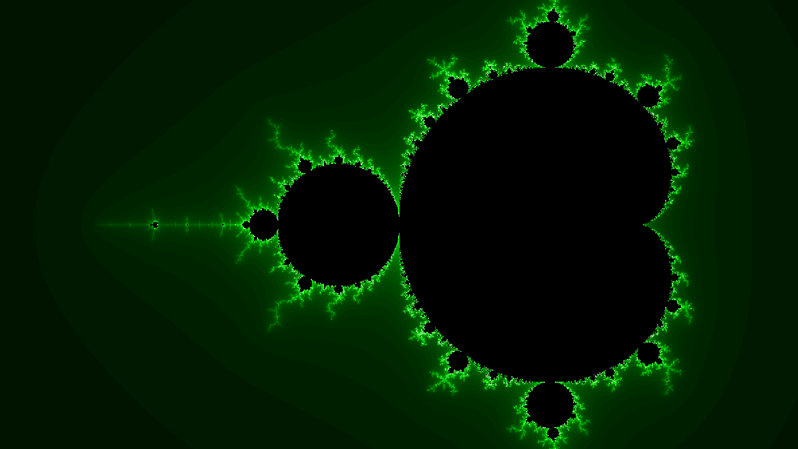

# MandelPlot
A JavaScript-powered Mandelbrot set grapher! To use, visit the website [here](https://vivaansinghvi07.github.io/mandelplot/).

## Credits 
- Moveable Elements from [w3schools](https://www.w3schools.com/howto/howto_js_draggable.asp)
- Animations from [animejs](https://animejs.com)

## Features
- Multiple, easy to add color schemes
- Animations upon zooming in and out
- Usage of web workers to make tasks more efficient
- Custom bound settings
- Display of point at click location
- Saving of zoom history for better animations
- Easy image saving of the plot (canvases can be saved using normal image-saving techniques)

## Usage
- Click anywhere on the graph to zoom. By toggling the "Animated" checkbox, you can turn on and off animations. 
- You can adjust the resolution, number of web workers, and the color scheme of the graph. Press "Apply Settings" to implement any changes, while still preserving the state of the graph.
- You can set custom bounds and apply them using "Apply Bounds."
- You can zoom out of the graph using "Undo Zoom." Zoom history is saved so you can do this as many times as you want.
    - However, zoom history is cleared upon resizing the page or setting custom bounds.
- By pressing "Reset", you can go back to the original version of the set.

## Example
Here are some examples of images taken using this tool!

Bounds:  
-2.4 < x < 0.9  
-0.9290457589285714 < y < 0.9290457589285714

Bounds:  
0.35405901227678593 < x < 0.36230901227678597  
0.6123875558035716 < y < 0.6170327845982145

Bounds:  
-0.7256177142857145 < x < -0.7245617142857146  
0.27432045535714294 < y < 0.2749150446428572

